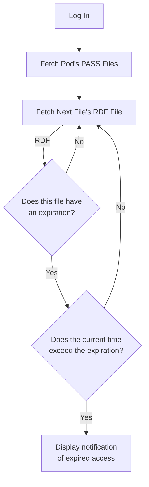

# File Expiration Timer

## Use Case: File Uploads Default to Having an Expiration

## Use Case: User Signs into PASS and Is Notified of Expired ACLs

```mermaid
flowchart TD;
    LogIn[Log In] --> FetchPodFiles[Fetch Pod's PASS Files];
    FetchPodFiles --> FetchNextFileRDF[Fetch Next File's RDF File];

    FetchNextFileRDF -- RDF --> TryFindExpireField{Does this file have\nan expiration?};

    TryFindExpireField -- Yes --> EvaluateExpiration{Does the current time\nexceed the expiration?};
    TryFindExpireField -- No --> FetchNextFileRDF;

    EvaluateExpiration -- Yes --> NotifyInBrowserOfExpiration[Display notification\nof expired access];
    EvaluateExpiration -- No --> FetchNextFileRDF;
```
