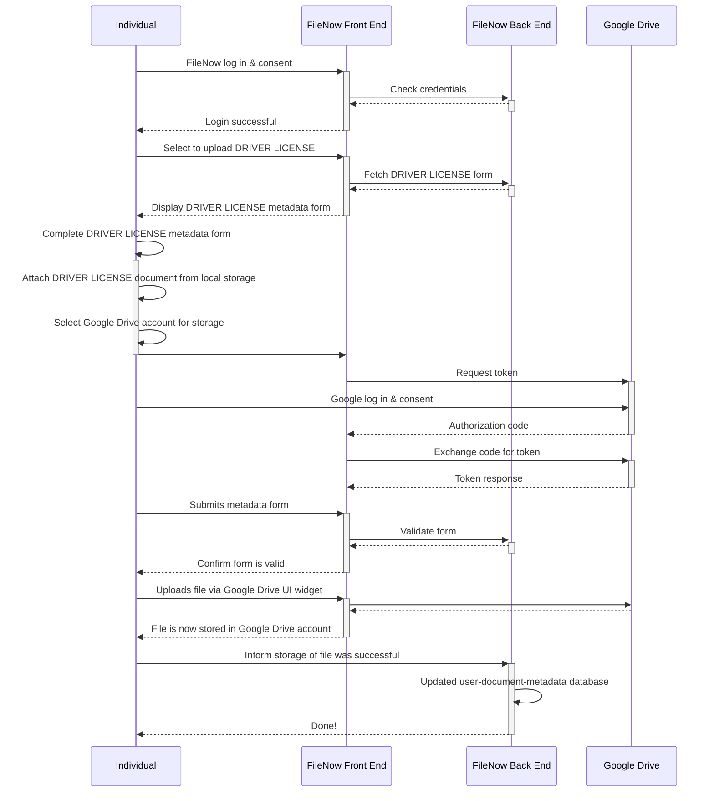

# FileNow: Design Document

## Overview

FileNow offers a risk-mitigated solution to simplify
storing and locating files across multiple cloud storage providers
and sharing the dispersed cloud files with others.
The intended audience for this document is the PASS team.
Readers do not need a technical background.

## Problem

The current PASS solution using the Solid ecosystem is attempting to solve the following problem:

* Individuals who are seeking social services are unable to preserve physical copies of necessary documents.

However, this solution:

* Does not meet end users where they are in their personal digital transformation journey.
    * End users are likely already using storage services such as Google Drive, Apple iCloud, and Dropbox.
      Advanced users may be using object stores, such as Amazon Web Services S3.
      Requiring users to put documents in yet another storage service is a risk to adoption.
* Relies on the Solid ecosystem, which is dependent on a number of web specifications that are not yet stable.
* Will require the PASS development team to build a reliable storage service to meet stakeholder availability expectations.
    * If not the PASS development team, then some government organization.
    * If not some government organization, then some privately funded company.

This proposal redefines the problem to be:

* Users have access to many high-quality, free storage services, but they do not have a way to organize and recall where their files are located across their digital storage accounts.
* Users do not have a way to bulk download files across their digital storage accounts.
* Users do not have a way to bulk share files with other people across their digital storage accounts.

The solution outlined in this document, referred to as FileNow, applies the concept of an address book to digital documents.
Digital documents are stored in a variety of safe and secure third-party storage services.
As users obtain more digital accounts and migrate to different mobile platforms, their preferred or default storage service changes.
A consequence of this is that digital documents are spread across multiple storage services.
FileNow's objective is to help users map a document type (e.g., drivers license, birth certificate, vaccination record) to its digital document.

## Tenets

The tenets held through this design are:

* Meet users where they are in their personal digital transformation.
* Embrace the marketplace of cloud vendors.
* Digital documents are as unique as personal contacts and should be treated with the same sophistication.

## Context and Scope

### Part 1: The needle in a stack of needles ("It's in here, I know it!").

Many people in crisis already own an Android or Apple device, giving them access to *free, reliable, and secure* cloud storage.
These devices are often equipped with a camera and support the automatic back up of files to the cloud.
For example, Android devices allow you to log into your Google account to seamlessly and automatically back up the photos you take with the device's camera to Google Drive.
Here we identity the first part of our scope:

> Storing digital files in cloud storage providers has never been easier,
> as it is often an asynchronous background task on devices and the user is rarely required to be in the loop.
> Remembering what files and where they are in the cloud, however, is a challenge.

Some cloud storage providers provide users with a searchbox to enable users to search for documents.
This can work well in some cases, but it under performs for photos.
For example, it was not uncommon to see people endlessly scrolling through their cloud storage accounts trying to find the picture they took of their COVID-19 vaccination card.

FileNow will allow a user to annotate a file with metadata that will be used to quickly recall the file using its search capability.
FileNow will only store the file's metadata, not the actual file.
Searching for a file cataloged in FileNow simply reveals the link to the file on whatever cloud storage provider hosts it.

### Part 2: Users use multiple cloud storage providers. Embrace it.

The benefit of cloud storage providers is that they are tied to a personal account, not a specific device.
These personal accounts, however, are specific to the cloud storage provider (e.g., Google accounts are tied to, you guessed it, Google Drive).
When a person switches from one device vendor to another (e.g., from Android to Apple), digital documents become dispersed across multiple accounts and, therefore, multiple cloud storage providers.
This brings us to the second part of our scope:

> Users have digital documents across cloud storage providers.
> They should have the freedom to store whatever they want, wherever they want.
> However, they need a Rolodex to remember where their files are stored, especially the important ones.

We are very used to the idea of adding a friend's information into our cloud-backed contacts applications.
Since no one bothers with remembering the layout of the city they live in anymore,
we simply open our contacts application on our phones,
type our friend's name,
and click their address to open our phone's map navigation application.
This is the type of workflow we are used to -- it's simple and intuitive.

FileNow will act as the "digital file locator" analog for the contacts application that geo-locates a friend's house.
"I know I took a picture of my COVID-19 vaccination card, but I can't remember if it was on my Google Pixel or my iPhone!"
FileNow will allow the user to annotate files and then search for those files by their user-assigned metadata.
Templates will be provided to give the metadata more structure.
For example, if you're uploading a digital copy of your driver's license, then FileNow will ask you to fill in its issue and expiration dates and what cloud storage provider you want to store it in.
Afterwards, you can use FileNow to search for any valid licenses you have in your cloud storage providers.

### Part 3: Streamline document delivery

A critical aspect to the problem PASS is solving is easing the transfer of documents from an individual to an organization.

This needs more thought.
Some ideas:

* Bulk share
* TODO

## Requirements

The following user stories capture the high-level requirements:

* As an individual, I want to add a new file to _\<storage service\>_ through FileNow.
* As an individual, I want to add a file to FileNow that already exists in my _\<storage service\>_ account.
* As an organization, I want to indicate to an individual whether she has the necessary documents in their FileNow for one of my services.
* As an individual, I want to quickly send a copy of one or more files that are dispersed across one or more cloud storage services over email.

Supported storage services will cover the dominate share of cloud storage and shall be:

* Google Drive
* Apple iCloud

## Architecture

TODO

## Appendix A: User Story Sequences

### User Story: Store New File via FileNow to Google Drive

As a user, I want to upload an important local file to my Google Drive account through FileNow.

## Appendix B: Existing Solutions

### MultCloud

[MultCloud}(https://www.multcloud.com/) is a cloud file manager with an emphasis on easing the transfer of files across clouds.
MultCloud users can also manage private file sharing or public file sharing from a single web interface.
Below are the pricing tiers for MultCloud (full details are provided at <https://www.multcloud.com/price>):

* Limited data plans
  * 5 GB/Month - $0
    * 5 GB free data traffic per month
    * 2 threads for data transfer
  * 1200 GB/Year - $9.99/Month or $119.88/Year
    * 1200 GB data traffic per year
    * 10 threads for data transfer
    * Scheduled transfer/sync/backup
  * 2400 GB/Year - $19.98/Month or $239.76/Year
    * 2400 GB data traffic per year
    * 10 threads for data transfer
    * Scheduled transfer/sync/backup
* Unlimited data plans
  * Free - $0
    * 5 GB free data traffic per month
    * 2 threads for data transfer
  * Yearly Unlimited - $299/Year
    * Unlimited data traffic per year
    * 10 threads for data transfer
    * Scheduled transfer/sync/backup
  * Lifetime Unlimited - $628 (onetime payment, lifetime use)
    * Unlimited data traffic per year
    * 10 threads for data transfer
    * Scheduled transfer/sync/backup

#### Comparison

MultCloud is a comprehensive solution and offers nearly everything and more that FileNow proposes to offer.
The advantage of FileNow is the ability to describe metadata about a file to quickly search for it.
MultCloud also appeals to a different audience than FileNow.
Users of FileNow are not concerned with transferring files between clouds.
Instead, they are concerned with quickly finding an important file across their cloud accounts.
