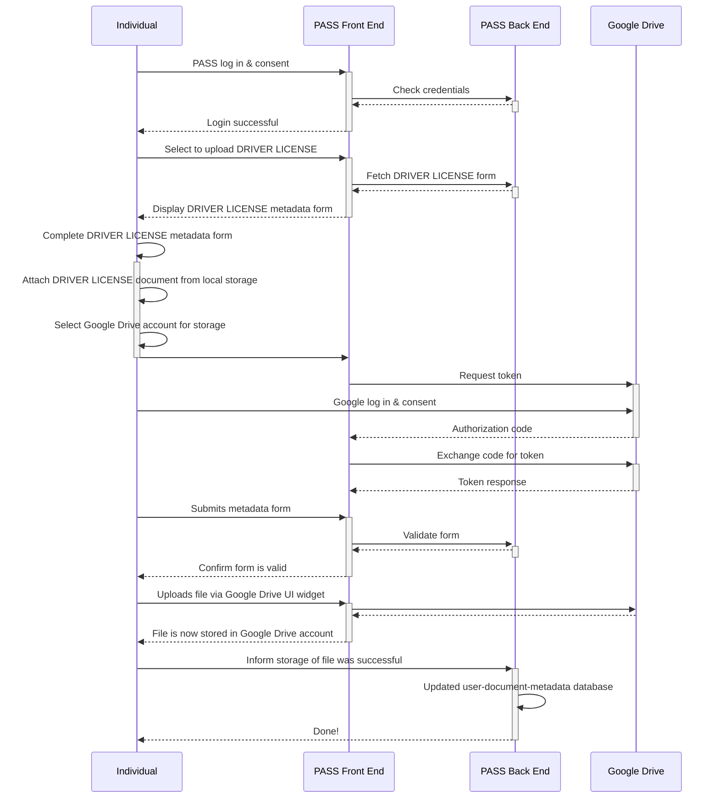

# Document Lookup

## Overview

This document is written for the PASS development team although readers do not need a technical background.
Its purpose is to propose an alternative solution to the problem identified by the PASS project.

## Problem

The current PASS solution using the Solid ecosystem is attempting to solve the following problem:

* Individuals who are seeking social services are unable to preserve physical copies of necessary documents.

However, this solution:

* Does not meet end users where they are in their personal digital transformation journey.
    * End users are likely already using storage services such as Google Drive and Dropbox.
      Advanced users may be using object stores, such as Amazon Web Services S3.
      Requiring users to put documents in yet another storage service is a risk to adoption.
* Relies on the Solid ecosystem, which is dependent on a number of web specifications that are not yet stable.
* Will require the PASS development team to build a reliable storage service to meet stakeholder availability expectations.
    * If not the PASS development team, then some government organization.
    * If not some government organization, then some privately funded company.

This proposal redefines the problem to be:

* Users have access to many high-quality, free storage services, but they do not have a way to organize and recall where their necessary files are located across their digital storage accounts.

The solution outlined in this document, referred to as Document Lookup, applies the concept of an address book to digital documents.
Digital documents are stored in a variety of safe and secure third-party storage services.
As users obtain more digital accounts and migrate to different mobile platforms, their preferred or default storage service changes.
A consequence of this is that digital documents are spread across multiple storage services.
Document Lookup's objective is to help users map a document type (e.g., drivers license, birth certificate) to its digital document.

## Tenets

The follow are the tents of the design proposed in this document:

* Meet users where they are to provide a trustworthy, intuitive solution.

## Requirements

The following user stories capture the high-level requirements:

* As an individual, I want to add a new necessary file to _\<storage service\>_ through Document Lookup.
* As an individual, I want to add a necessary file to Document Lookup that already exists in my _\<storage service\>_ account.
* As an organization, I want to indicate to an individual whether she has the necessary documents in their Document Lookup for one of my services.

Supported storage services shall be:

* Google Drive
* Apple iCloud

## Architecture

TODO

## Appendix A: User Story Sequences

### User Story: Store New File via Document Lookup to Google Drive

As a user, I want to upload an important local file to my Google Drive account through Document Lookup.

